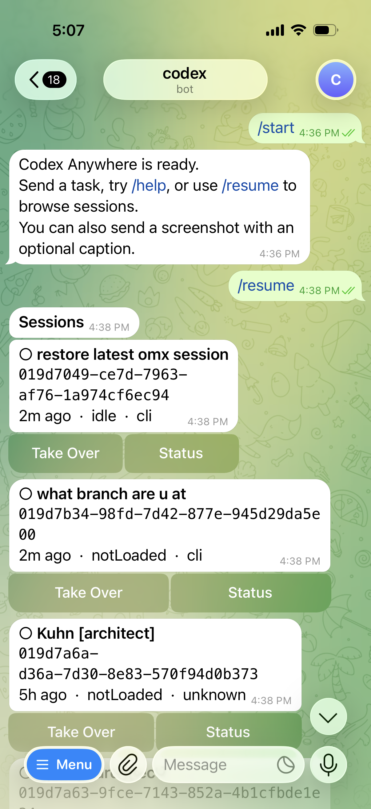
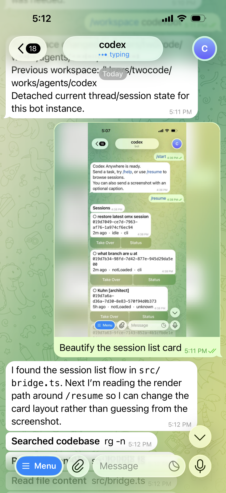
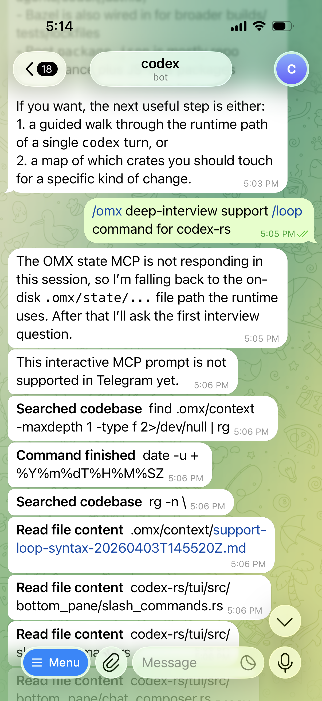
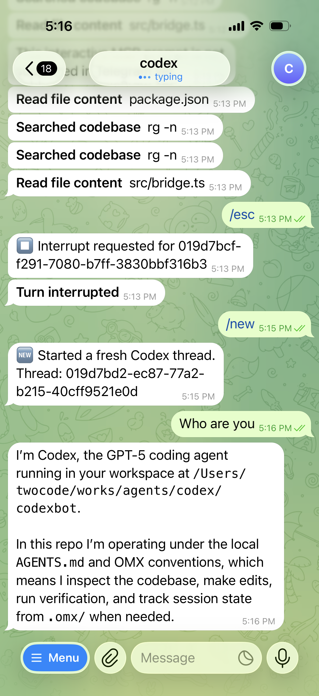

# Codex Anywhere

Codex Anywhere is a Telegram-native client for `codex`, helping to achieve flow state with session continuity, native codex commands and features, anytime anywhere, no extra API key.

<table width="100%">
  <tr>
    <td width="25%" align="center" valign="top">
      <br/>
      <b>Session continuity</b><br/>
      Browse and resume recent Codex sessions from your phone
    </td>
    <td width="25%" align="center" valign="top">
      <br/>
      <b>Image + text turns</b><br/>
      Send a screenshot with a caption — both land in one Codex turn
    </td>
    <td width="25%" align="center" valign="top">
      <br/>
      <b>OMX integration</b><br/>
      Run <a href="https://github.com/Yeachan-Heo/oh-my-codex">oh-my-codex</a> workflows and commands directly from Telegram
    </td>
    <td width="25%" align="center" valign="top">
      <br/>
      <b>Turn control</b><br/>
      Start new sessions, steer active turns, queue or interrupt on the fly
    </td>
  </tr>
</table>

## Prerequisites

- **[codex](https://github.com/openai/codex)** — installed and authenticated
- A **Telegram account** and a bot token from [@BotFather](https://t.me/BotFather)

## Quick Start

### 1. Install

```bash
npm install -g codex-anywhere
```

### 2. Create a Telegram bot

Open [@BotFather](https://t.me/BotFather) in Telegram, send `/newbot`, and follow the prompts.
Copy the bot token it gives you — you'll need it in the next step.

### 3. Connect

```bash
codex-anywhere connect
```

```
Telegram bot token (from BotFather): <paste your token here>
Workspace path for Codex tasks [/current/dir]:  ← press Enter to accept
```

The workspace defaults to wherever you run `connect` from. The setup validates the token, checks that `codex` is on `PATH`, and starts the bridge.

### Add another Telegram bot

```bash
codex-anywhere add-bot
```

This appends one bot definition to the shared config. After saving, restart the service or rerun `connect` to launch the new bot.
If your install still uses the older single-bot config, run `codex-anywhere connect` once first so it can migrate to the current protocol.

### 4. Install the background service

```bash
codex-anywhere install-service
```

This registers a LaunchAgent (macOS) so the bot starts at login and keeps running when the terminal closes.
On Linux, it installs a user-level `systemd` service under `~/.config/systemd/user` and enables it immediately.

### 5. Open Telegram and send `/start`

Your bot is ready. Try `/help` to see available commands, or just send a task to begin.

## Usage

**Resume an existing Codex session:**
- send `/resume` to browse sessions in the current workspace
- session lists are paginated at 8 items per page
- tap `Take Over` to bind the Telegram chat to that session

**Continue from any workspace:**
- send `/continue` to browse sessions globally
- send `/continue <session-id>` to continue a specific session directly
- global session lists are paginated at 8 items per page
- if the target session belongs to another workspace, Codex Anywhere asks before switching workspace
- after takeover, Codex Anywhere shows a compact preview of the last 3 turns to restore context

**Reload the current session:**
- send `/reload` to pull the latest context for the currently bound session
- `/reload` never browses, switches, or selects another session

**Start a new session:**
- send `/new`, or just send a task like `fix tests`

**Steer an active turn:**
- send a follow-up message to redirect mid-turn
- use `Queue Next` to stage the next message without interrupting
- use `Interrupt` (or `/esc`) to stop the current turn

**Use images:**
- send a screenshot or photo with a caption — both are included in the same Codex turn

**Use [oh-my-codex](https://github.com/Yeachan-Heo/oh-my-codex) workflows:**
- run `$deep-interview`, `$autopilot`, and other OMX skills directly in the chat
- use `/omx status`, `/omx doctor`, and other CLI commands via `/omx <args>`

**Use Computer Use:**
- send `/computer <task>` to route a task through the bundled Computer Use plugin
- Computer Use must be enabled from the Codex app before `/computer` can control the desktop

**Add another bot from Telegram:**
- send `/addbot` from the currently paired admin bot
- reply with bot id, label, BotFather token, and workspace path
- the new bot is added to shared config and started immediately in the running supervisor

## Service Management

```bash
codex-anywhere service-status
codex-anywhere uninstall-service
```

Logs are written to `logs/` under the Codex Anywhere storage root (`CODEX_ANYWHERE_HOME`).
Multi-bot installs also keep bot state under `bots/<bot-id>/state.json` and shared session ownership in `session-ownership.json`.

## Telegram Commands

Telegram-native:

| Command | Description |
|---|---|
| `/workspace <path>` | Show or change the bot workspace |
| `/addbot` | Add and start another Telegram bot from chat |
| `/resume` | Browse and continue sessions in the current workspace |
| `/continue [session-id]` | Browse all sessions globally or continue by exact session id |
| `/reload` | Pull the latest context for the current session |
| `/verbose [on\|off\|status]` | Toggle detailed tool/file output cards |
| `/omx [args]` | Run [oh-my-codex](https://github.com/Yeachan-Heo/oh-my-codex) CLI commands from Telegram |
| `/computer <task>` | Run a task through the bundled Computer Use plugin |
| `/esc` `/ese` | Interrupt aliases |

Codex slash commands supported through the bridge:

`/start` `/help` `/new` `/resume` `/continue` `/reload` `/interrupt` `/cancel` `/status` `/workspace` `/addbot` `/omx` `/computer` `/model` `/fast` `/personality` `/permissions` `/sandbox` `/plan` `/collab` `/agent` `/subagents` `/review` `/rename` `/fork` `/compact` `/clear` `/diff` `/copy` `/mention` `/skills` `/mcp` `/apps` `/plugins` `/feedback` `/experimental` `/rollout` `/logout` `/quit` `/exit` `/stop`

## Development

Clone and install:

```bash
git clone https://github.com/Mempat-AI/codex-anywhere
cd codex-anywhere
pnpm install
pnpm run connect   # runs directly from src/ via tsx
pnpm run add-bot   # appends a new bot definition to config
```

Run checks:

```bash
pnpm run test
pnpm run typecheck
pnpm run build
```

The `test` lane is fully local and deterministic — no real Telegram, `codex`, `omx`, or network access. CI covers mocked E2E startup, routing, `/omx` commands, session continuity flows, and preflight failure paths.

## Contributing

Use pull requests for all changes.

Repository policy:
- PR title gate
- CI gate
- squash merge only
- no merge commits
- no rebase merges

See [CONTRIBUTING.md](./CONTRIBUTING.md) for contribution rules.

## Notes

- Single-user (for now), private chats only
- `codex` must be installed and authenticated before setup
- Config and state live under the user config directory or `CODEX_ANYWHERE_HOME`
- Background service install supports macOS LaunchAgent and Linux user-level `systemd`

---

Not affiliated with OpenAI.

Built with 💡 in Singapore.
